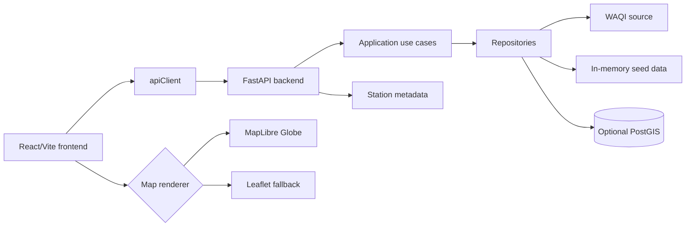

# Aire Argentina

Aire Argentina is an interactive air-quality viewer for Argentina. It uses real station data from WAQI, a FastAPI backend, and a React/Vite frontend with MapLibre Globe and Leaflet fallback. The UI distinguishes current thermal interpolation from old measurements so stale data is not presented as current air quality.

## Overview

The project is split into a frontend SPA and a modular FastAPI backend:

- The backend exposes regions, stations, metadata, spatial endpoints, source status, and history-ready contracts.
- The frontend loads regions/stations through the backend only; source API tokens are never exposed to the browser.
- Current thermal maps use measurements up to 72 hours old.
- Measurements older than 72 hours remain visible as last available measurements and can be viewed in an explicit `Últimas mediciones` mode.

## Demo / Project Status

This repository contains production-oriented deployment configuration for Render (backend) and Vercel-style frontend deployment. Availability of a public production URL is not asserted here; verify the deployed environment before sharing it externally.

## Features

- Argentina-wide operational regions: Argentina, AMBA, Centro, Cuyo, NOA, NEA, Patagonia norte, Patagonia sur.
- Real station ingestion from WAQI via backend.
- National boundary filtering to remove foreign stations returned by rectangular source queries.
- Current thermal visualization with scientific freshness limits.
- Explicit last-measurements visualization for old station data.
- MapLibre Globe renderer with CARTO Dark Matter tiles.
- Leaflet fallback renderer.
- Pollutant selector for PM2.5, PM10, NO2, O3, SO2, and CO.
- Backend-offline, no-stations, no-pollutant-data, and expired-data-only UI states.
- Test coverage for backend API/CORS/sources/spatial logic and frontend map/data/UI helpers.

## Architecture



Detailed architecture: [docs/architecture.md](docs/architecture.md).

## Stack

| Area | Technology |
| --- | --- |
| Frontend | React 18, Vite 5, TypeScript, Tailwind CSS, Radix/shadcn-style components |
| Maps | MapLibre GL JS 6, Leaflet, leaflet.heat, CARTO raster tiles |
| Backend | FastAPI, Pydantic Settings, SQLAlchemy, Alembic, httpx |
| Spatial | In-memory GIS repository by default; optional PostgreSQL/PostGIS path |
| Tests | Vitest, Testing Library, pytest |
| Deploy | Vercel-compatible frontend, Render backend config |

## Repository Structure

```text
src/                  React frontend, map renderers, data helpers and tests
backend/app/          FastAPI app, domain, application, infrastructure and GIS layers
backend/tests/        Backend pytest suite
docs/                 Technical and functional documentation
docs/adr/             Architecture Decision Records
gis/                  Placeholder folders/docs for future official GIS data
render.yaml           Render backend service configuration
docker-compose.yml    Optional local PostGIS service
```

## Requirements

- Node.js compatible with Vite 5.
- pnpm recommended because `pnpm-lock.yaml` is present.
- Python 3.13.
- A Python virtual environment with the project installed.
- WAQI token for real station data.
- Optional Docker Desktop for local PostGIS validation.

## Installation

```powershell
cd C:\dev\boludesesPiolasCat\aire-amba-tracker
pnpm install
\.venv\Scripts\Activate.ps1
python -m pip install -e .
```

## Environment Variables

Copy the root example and fill local secrets yourself. `backend/.env.example` is a backend-only reference; the current settings object loads `.env` from the repository root.

```powershell
Copy-Item .env.example .env
```

Main variables:

| Variable | Side | Purpose |
| --- | --- | --- |
| `VITE_API_BASE_URL` | Frontend | Backend base URL for production builds. |
| `VITE_MAP_RENDERER` | Frontend | `leaflet` or `maplibre`; invalid values fall back to Leaflet. |
| `CORS_ORIGINS` | Backend | Comma-separated allowed browser origins. Wildcard is rejected. |
| `WAQI_TOKEN` / `WAQI_API_TOKEN` | Backend | WAQI API token. Do not expose to frontend. |
| `OPENAQ_API_KEY` | Backend | OpenAQ readiness key; integration is not enabled by default. |
| `DATABASE_URL` | Backend | SQLite or PostgreSQL database URL. |
| `SPATIAL_BACKEND` | Backend | `in_memory` or `postgis`. |

Full reference: [docs/environment.md](docs/environment.md).

## Local Development

Run backend and frontend in separate terminals.

Backend:

```powershell
cd C:\dev\boludesesPiolasCat\aire-amba-tracker
\.venv\Scripts\Activate.ps1
python -m uvicorn app.main:app --app-dir backend --host 127.0.0.1 --port 8000
```

Frontend:

```powershell
cd C:\dev\boludesesPiolasCat\aire-amba-tracker
pnpm install
$env:VITE_MAP_RENDERER="maplibre"
pnpm dev
```

Local URLs:

- Frontend: <http://127.0.0.1:8080>
- Backend: <http://127.0.0.1:8000>
- Health: <http://127.0.0.1:8000/health>
- Stations: <http://127.0.0.1:8000/stations?region=argentina>
- Metadata: <http://127.0.0.1:8000/stations/meta?region=argentina>
- Regions: <http://127.0.0.1:8000/regions>

Vite is configured with `strictPort: true`; if port `8080` is busy it fails instead of silently switching to `8081`.

## Tests

Frontend:

```powershell
npm run lint
npm test
npm run build
npx tsc -b --pretty false
```

Backend:

```powershell
pytest backend
ruff check backend
mypy backend
```

Details: [docs/testing.md](docs/testing.md).

## Build

```powershell
pnpm build
```

The MapLibre renderer is lazy-loaded but still creates a large production chunk; Vite may warn about chunks over 500 kB.

## Deploy

- Frontend: Vercel-compatible static build from `dist/`.
- Backend: Render service configured in `render.yaml`.
- Set `VITE_API_BASE_URL` in the frontend environment and redeploy after changing any `VITE_*` variable.
- Set backend secrets such as `WAQI_TOKEN` in Render, not in Git.

Deploy guide: [docs/deployment.md](docs/deployment.md).

## Data Sources

- WAQI is the active station data source.
- OpenAQ connector/readiness exists but is disabled by default and is not merged into `/stations` yet.
- CARTO Dark Matter raster tiles are used for basemaps with OpenStreetMap/CARTO attribution.

Details: [docs/data-sources.md](docs/data-sources.md).

## Quality And Freshness Rules

- 0-6 h: full current weight.
- 6-24 h: reduced current weight.
- 24-72 h: old but still eligible for current thermal interpolation with reduced weight.
- More than 72 h or unknown timestamp: excluded from current heatmap/groups/hotspots.
- Old measurements remain visible as stations and can be shown in `Últimas mediciones` mode.

Details: [docs/data-quality.md](docs/data-quality.md).

## Map Renderers

- `VITE_MAP_RENDERER=maplibre`: MapLibre Globe with raster CARTO basemap and GeoJSON sources/layers.
- `VITE_MAP_RENDERER=leaflet`: Leaflet fallback with `leaflet.heat`.
- Default renderer is Leaflet when the flag is unset or invalid.

Map details: [docs/maps.md](docs/maps.md).

## API

Core endpoints used by the frontend:

- `GET /health`
- `GET /regions`
- `GET /stations?region=argentina`
- `GET /stations/meta?region=argentina`

Full backend API reference: [docs/backend.md](docs/backend.md).

## Current Limitations

- WAQI coverage in Argentina is sparse and station update frequency depends on each source station.
- Current heatmaps are station-derived visual interpolations, not measured values between stations.
- OpenAQ is readiness-only and not enabled as an operational station source.
- Official GIS datasets are not loaded yet; operational regions are rectangular source-query windows.
- PostGIS path exists but local validation requires a reachable PostgreSQL/PostGIS service.

## Roadmap

- Complete OpenAQ integration only after AQI/concentration mapping and freshness policy are defined.
- Add official GIS boundaries through the existing GIS module and repository interfaces.
- Improve source observability and cache introspection.
- Add CI once repository hosting and deployment policy are finalized.

## Contributing

Keep frontend/backend boundaries intact:

- Do not expose source tokens in frontend code.
- Keep data-quality rules covered by tests.
- Update documentation when adding endpoints, variables, layers, or source behavior.
- Run frontend and backend validation before opening changes.

## License

No license file was found in the repository at the time of this audit. Add a license before distributing or accepting external contributions.

## Data Disclaimer

This project visualizes third-party station data and derived visual interpolations. It is not an official regulatory air-quality product. Heatmaps estimate spatial patterns from available stations and should not be interpreted as direct measurements between stations.
