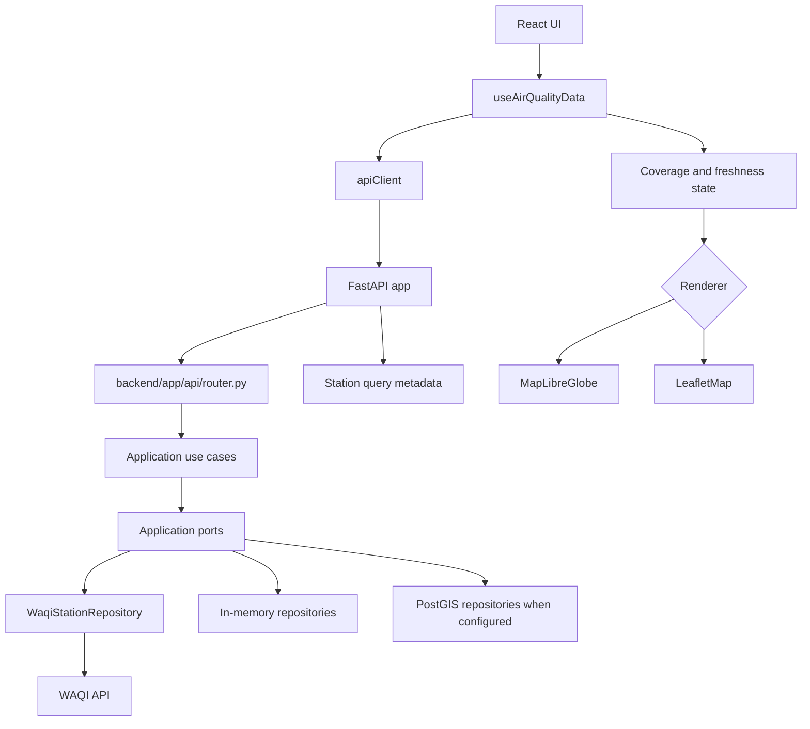
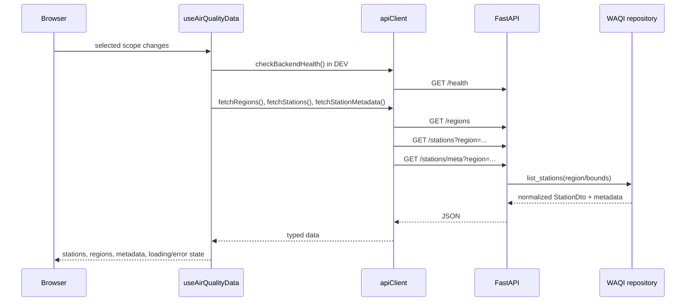
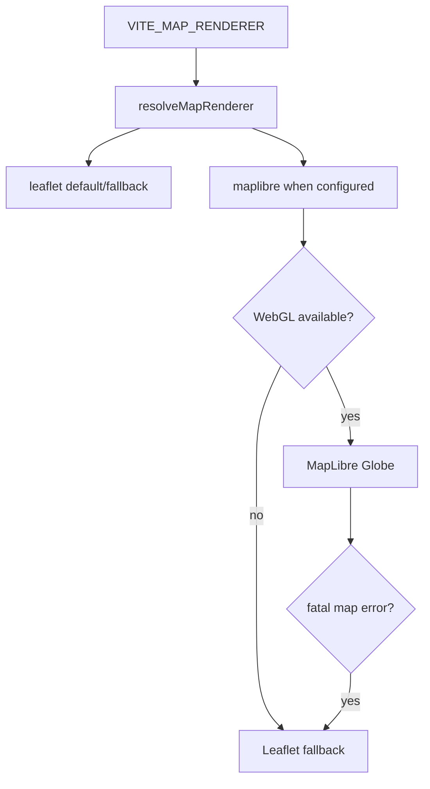

# Architecture

This document describes the architecture observed in the repository. It does not describe planned behavior unless explicitly marked as future/readiness.

## System Flow



## Runtime Boundaries

| Layer | Location | Responsibilities |
| --- | --- | --- |
| Frontend UI | `src/components`, `src/pages` | Region/pollutant selection, panels, current/latest modes, map rendering. |
| Frontend data | `src/hooks/useAirQualityData.ts`, `src/lib/apiClient.ts` | Backend requests, local cache, loading/offline state. |
| Frontend domain helpers | `src/lib/*` | AQI categories, freshness, coverage, MapLibre GeoJSON, historical thermal mode. |
| Backend API | `backend/app/api` | FastAPI routes, schemas, dependencies, errors. |
| Backend application | `backend/app/application` | Use cases and repository/source ports. |
| Backend domain | `backend/app/domain` | Models, regions, station coverage, national boundary, domain errors. |
| Infrastructure | `backend/app/infrastructure`, `backend/app/db` | WAQI/OpenAQ/demo connectors, repositories, SQLAlchemy/PostGIS adapters. |
| GIS | `backend/app/gis`, `gis/` | Spatial utilities, loaders, repository interfaces, future official GIS data. |

## Frontend To Backend Flow



## Thermal Pipeline

```mermaid
flowchart LR
  Stations[Station[]] --> Pollutant[pollutantValue iaqi[selectedPollutant]]
  Pollutant --> Freshness[freshnessMultiplier]
  Freshness --> Current{<= 72h?}
  Current -- yes --> Heat[stationsToHeatGeoJSON / heatPointsForPollutant]
  Current -- yes --> Groups[visualGroupsForStations]
  Current -- yes --> Hotspot[findPollutantHotspot]
  Current -- no --> Expired[expired marker + latest measurements]
  Stations --> Historical[stationsToHistoricalHeatGeoJSON]
  Historical --> LatestMode[Últimas mediciones mode]
```

## Renderer Selection



## Configuration By Environment

- Frontend local default API base: `http://127.0.0.1:8000`.
- Frontend production requires `VITE_API_BASE_URL`; `apiClient.ts` throws if missing.
- Local Vite server is pinned to `127.0.0.1:8080` with `strictPort: true`.
- Backend reads settings from `.env` with no prefix via `pydantic-settings`.
- CORS defaults include local `8080`, local `5173`, `https://aire-ba.vercel.app`, and Vercel preview regex.

## Error Handling

- Browser fetch failures become `No se pudo conectar al backend`.
- Backend domain errors are mapped in `backend/app/api/errors.py`.
- MapLibre initialization failures trigger renderer fallback to Leaflet.
- Old data is not treated as backend failure; it becomes `expired-data-only` in the UI.

## Infrastructure Notes

- Render backend configuration is in `render.yaml`.
- Optional local PostGIS service is in `docker-compose.yml`.
- The frontend build is static and Vercel-compatible, but no Vercel config file was found.
