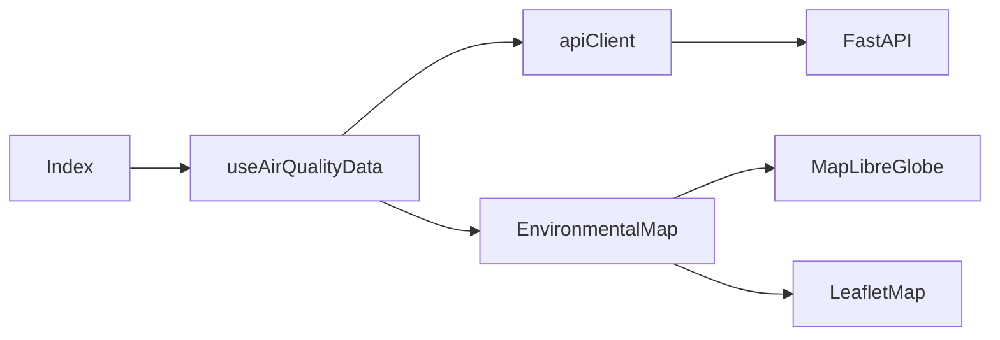

# Frontend

The frontend is a React 18 SPA built with Vite, TypeScript, Tailwind CSS, Radix/shadcn-style UI primitives, MapLibre GL JS, and Leaflet.

## Entrypoints

- `src/main.tsx`: React root.
- `src/App.tsx`: router/app shell.
- `src/pages/Index.tsx`: main page wiring data and map.

## Data Flow

`useAirQualityData(scope)` fetches regions, stations and metadata, caches them for 10 minutes, refreshes every 10 minutes, and exposes loading/error state.

## Key Components

| Component | Purpose |
| --- | --- |
| `Index` | Page layout, header guide button, stats cards, passes data to map. |
| `EnvironmentalMap` | Core interaction surface: pollutant selection, current/latest mode, coverage states, contextual panels. |
| `MapLibreGlobe` | MapLibre renderer with globe projection, GeoJSON sources/layers, camera helpers and Leaflet fallback trigger. |
| `LeafletMap` | Fallback renderer using CARTO tiles, `CircleMarker`, and `leaflet.heat`. |
| `EducationGuide` | User-facing guide sheet/dialog. |
| `StaticMapFallback` | Fallback UI when dynamic map fails. |
| `BottomBar` | Region/scope navigation. |

## Helpers

| Helper | Purpose |
| --- | --- |
| `apiClient.ts` | Backend requests and production API base validation. |
| `pollutantHeat.ts` | Selected pollutant values, freshness bands, current heat points. |
| `historicalThermal.ts` | Explicit last-measurements thermal mode. |
| `thermalCoverage.ts` | Derived UI states such as `expired-data-only`. |
| `maplibreHeat.ts` | Current MapLibre GeoJSON, groups, hotspots and expressions. |
| `maplibreSourceSync.ts` | Source IDs and `setData` sync. |
| `maplibreGlobe.ts` | Cameras, layer order, camera animation and projection helpers. |
| `aqiHeatScale.ts` | AQI categories, colors, heat weights and legend data. |
| `argentinaBoundary.ts` | Frontend station boundary check consistent with backend. |

## Loading And Errors

- DEV checks `/health` before station fetches.
- Fetch connection failures become `No se pudo conectar al backend`.
- Backend offline is visually distinct from old-data states.
- Production fails fast if `VITE_API_BASE_URL` is not configured.

## Coverage States

`thermalCoverageState()` returns:

- `loading`
- `recent-data`
- `expired-data-only`
- `no-pollutant-data`
- `no-stations`

These states prevent confusing stale measurements with missing data or backend failures.

## Map Modes

- `Actual`: current thermal map using data up to 72 hours old.
- `Últimas mediciones`: separate historical/latest thermal layer that may include older data and is labeled as not current.

## Responsive Design

- Floating control bar at the top.
- Desktop contextual panel on the right.
- Mobile bottom-sheet-like panels with `100dvh`, safe-area padding, internal scroll and Escape close behavior.

## Accessibility

- Mode selector uses `role="group"` and `aria-pressed`.
- Mode changes are announced with `aria-live`.
- Contextual panels have accessible labels and close buttons.
- Escape closes active panels.
- Color is supplemented with text labels such as `Dato antiguo` and `No representa la calidad del aire actual`.
